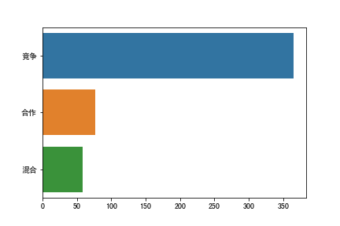

### 分析集石桌游,集石top500

>
>桌游游戏模式三种,竞争,合作,还有混合,三种分布为
- **竞争** ：    365
- **混合** ：     77
- **合作** ：    58

>
>top500中,游戏标签有9种德式,美式,卡牌,家庭,角色扮演,战棋,抽象,聚会,儿童
- **德式** ：      193
- **美式** ：      115
- **卡牌** ：      95
- **家庭** ：      80
- **角色扮演** ：   56
- **战棋** ：      54
- **抽象** ：      26
- **聚会** ：      17
- **儿童** ：       6

>top500中,桌游生产年份最多的是个份
- **2019** ：     86
- **2018** ：    84
- **2017** ：    57
- **2016** ：    41
- **2015** ：    40
- **2014** ：    30
- **2011** ：    24
- **2012** ：    20
- **2010** ：    15
- **2013** ：   15

>前一百名高分游戏,生产年份前十名分布

- **2018** ：     19
- **2019** ：    17
- **2017** ：    13
- **2016** ：    9
- **2015** ：    7
- **2014** ：    5
- **2011** ：    4
- **2007** ：    3
- **2013** ：    3
- **2005** ：   2

